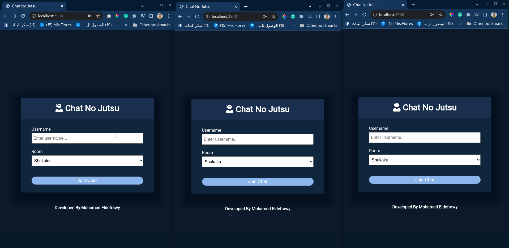

# node.js Chat application

A chat room application 
## Table of contents

- [Overview](#overview)
    - [Screenshot](#screenshot)
- [My process](#my-process)
    - [Built with](#built-with)
- [Author](#authors)

## Overview

### GIF



## My process

1) Clone the project

   ``` https://github.com/MohamedEldefrawy/Chat-Room-NodeJs.git```
2) install [node](https://nodejs.org/en/download/)
3) in the project directory run the following
4) ```
   npm install
   ```
    ```
    npm run dev
    ```

### Built with

* [Node JS](https://nodejs.org/en/download/)
* [express.js](https://expressjs.com/)
* [socket.io](https://nodejs.org/en/download/)
* [moment.js](https://momentjs.com/)
* [qs](https://www.npmjs.com/package/qs)
* [nodemon](https://www.npmjs.com/package/nodemon)

## Authors

* LinkedIn - [Mohamed Eldefrawy](https://www.linkedin.com/in/mohamedeldefrawy)

<p align="right">(<a href="#top">back to top</a>)</p>
